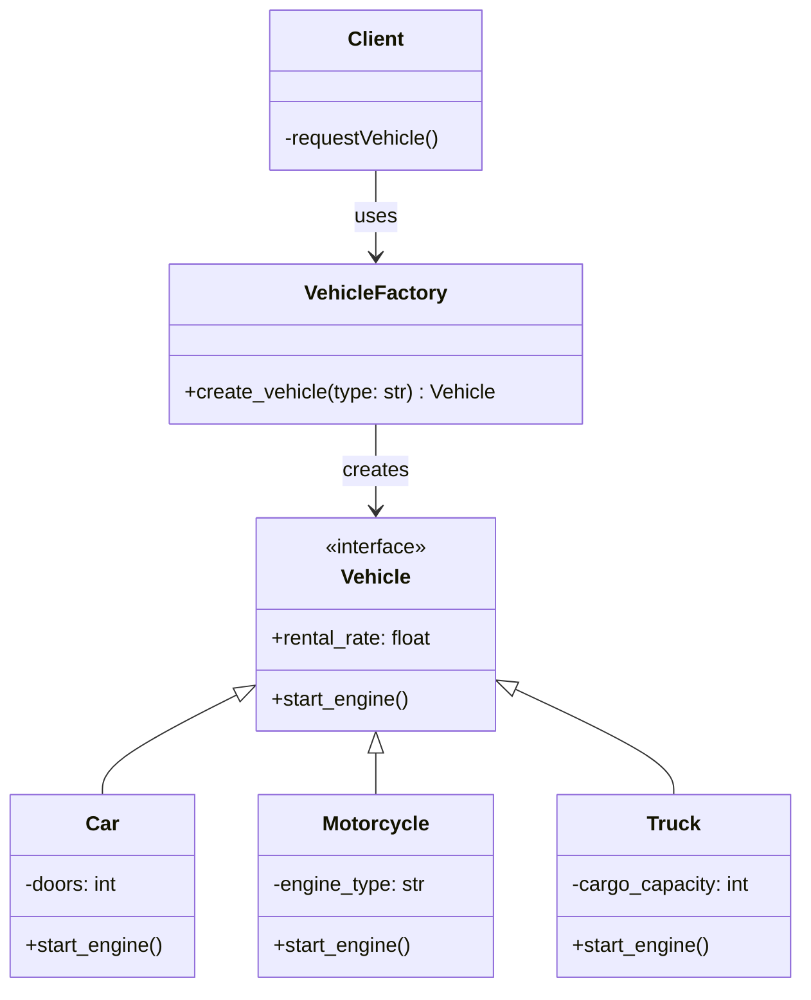

# Factory Pattern

## What is the Factory Pattern?

The Factory Pattern is a **Creational Design Pattern** that centralizes object creation logic. Instead of clients directly instantiating objects, they request them from a factory. This decouples client code from concrete classes and provides a single point of control for object creation.

**Key Principle**: "Encapsulate what varies" — object creation logic is encapsulated in a factory class.

## UML Class Diagram

**Key Relationships:**
- **Client** depends on Factory only (loose coupling)
- **Factory** creates Vehicle instances
- **Concrete Classes** (Car, Motorcycle, Truck) implement Vehicle interface

---

## Before vs After

| Aspect | Without Factory | With Factory |
|--------|-----------------|--------------|
| **Client Complexity** | High — must know all types | Low — asks factory for object |
| **Adding New Type** | Update all creation code | Update factory only |
| **Code Duplication** | Creation logic scattered | Centralized in factory |
| **Coupling** | Tight — depends on concrete classes | Loose — depends on factory |
| **Testing** | Hard to test without objects | Easy — factory can be mocked |

---

## Real-World Examples

### 1. Database Connection Pooling
Different databases need different connections (MySQL, PostgreSQL, MongoDB). A factory creates the right connection type without the application knowing the details.

### 2. Payment Processing
E-commerce systems need different payment processors (Stripe, PayPal, Square). A factory creates the right processor based on customer choice.

### 3. UI Framework Components
GUI frameworks create different widgets (Button, TextField, Checkbox) through a factory, so applications don't hard-code each type.

### 4. Cloud Storage Providers
Applications work with different cloud storage (AWS S3, Google Cloud, Azure). A factory creates the right storage client transparently.

### 5. Logging Frameworks
Logging systems create different loggers (file-based, database-based, cloud-based). A factory handles the creation based on configuration.

### 6. Transportation Booking Apps
Apps like Uber handle different vehicle types (UberX, UberXL, Uber Black). A factory matches riders with the right vehicle type.

### 7. Restaurant Ordering System
Restaurants have different delivery options (dine-in, takeout, delivery). A system factory prepares the order differently based on type.

---

## When to Use the Factory Pattern

**Use when:**
- Multiple object types with similar interfaces
- Object type is determined at runtime
- Object creation is complex
- You want to decouple clients from concrete classes
- You expect new types to be added frequently

**Avoid when:**
- Only one object type exists
- Object creation is simple (just calling constructor)
- Runtime type determination never happens

---

## Key Advantages

1. **Flexibility** — Easy to swap implementations
2. **Maintainability** — Changes in one place
3. **Testability** — Can mock factory for tests
4. **Scalability** — Add new types without affecting clients
5. **Encapsulation** — Hides complexity of object creation

---

## Key Disadvantages

1. **Extra Layer** — Additional abstraction level
2. **Complexity** — More classes to understand
3. **Overkill for Simple Cases** — Don't use if you don't need it

