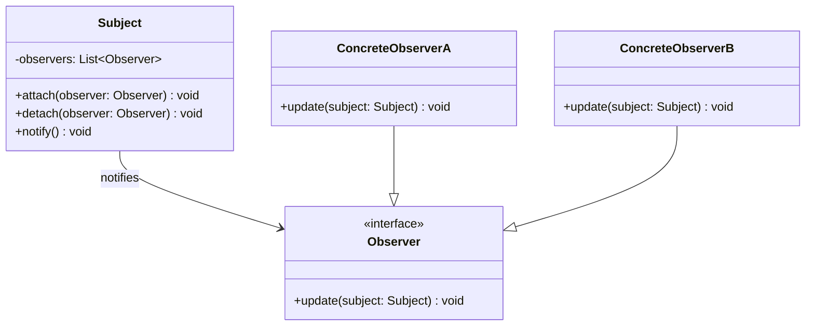

# Observer Pattern

The **Observer Pattern** defines a one-to-many relationship where multiple observer objects (subscribers) automatically receive notifications when a subject object (observable) changes state.

**Core Idea:** "When something important happens, tell everyone who cares."

### Key Benefits
- Loose coupling between subject and observers
- Easy to add/remove observers dynamically
- Follows Open/Closed Principle
- Supports real-time event propagation

---

## UML Diagram

---

## Real-World Examples

### 1. YouTube Channel Subscriptions
Channels notify all subscribers when new videos are uploaded. Subscribers can subscribe/unsubscribe dynamically.

### 2. Event Handling in GUI Applications
UI buttons, checkboxes, and text fields notify multiple event listeners (logging, sound effects, analytics) when user interactions occur.

### 3. Stock Market Price Changes
When a stock price changes, traders, notification systems, and analytics dashboards are automatically notified.

### 4. MVC (Model-View-Controller)
The Model (Subject) notifies multiple Views and Controllers (Observers) when data changes, so all UI components stay synchronized.

### 5. Pub/Sub Messaging Systems
- Kafka - Topics (subjects) and consumers (observers)
- RabbitMQ - Publishers and subscribers
- Redis PubSub - Channels and listeners
- AWS SNS - Topics and subscriptions

### 6. React/Vue Reactive State
Framework-level reactivity where components (observers) automatically re-render when state (subject) changes.

### 7. File System Watcher
File monitoring tools watch for file changes and notify loggers, validators, and build systems when modifications occur.

### 8. Email Notifications System
When an order is placed, Email, SMS, and Analytics services are simultaneously notified to send confirmations and log events.

---

## Quick Decision Tree

**Should you use Observer Pattern?**

Use when one object's state change needs to notify multiple other objects automatically, and the number/type of observers is unknown upfront or changes frequently.

---

## Key Takeaways

1. **Decoupling:** Subject doesn't know observer implementation details
2. **Extensibility:** Add new observers without modifying subject
3. **Real-world:** Most event-driven systems use this pattern
4. **Trade-off:** Slight performance overhead for flexibility
5. **Alternative:** Consider simpler patterns for simple cases
