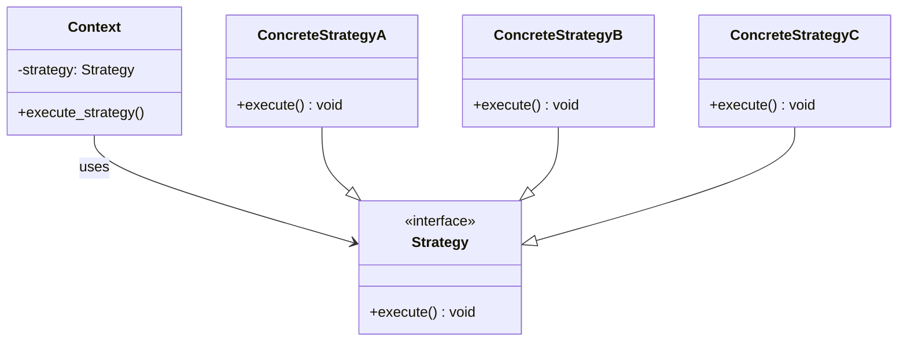

# Strategy Pattern

## Pattern Overview

The **Strategy Pattern** defines a family of algorithms, encapsulates each one, and makes them interchangeable. Strategy lets the algorithm vary independently from clients that use it.

**Core Idea:** "Encapsulate what varies, so behavior can be selected at runtime."

### Key Benefits
- Eliminates conditional logic (if-else chains)
- Runtime algorithm selection
- Easy to add new strategies without modifying existing code
- Follows Open/Closed Principle
- Enables algorithm reuse across different contexts

---

## UML Diagram



---

## Real-World Examples

### 1. Payment Processing Systems
Different payment methods can be selected at checkout:
- Credit Card payment strategy
- PayPal payment strategy
- Apple Pay payment strategy
- Cryptocurrency payment strategy
- Bank transfer payment strategy

The shopping cart doesn't care which strategy is chosen—it just processes the payment.

### 2. Sorting Algorithms
A sorting library can use different algorithms based on data size:
- **QuickSort** - For large datasets
- **MergeSort** - For stable sorting
- **InsertionSort** - For small arrays
- **HeapSort** - For memory constraints

Selection happens at runtime based on data characteristics.

### 3. Travel Route Navigation
Navigation apps offer different route strategies:
- Fastest route (minimize time)
- Shortest route (minimize distance)
- Scenic route (maximize sightseeing)
- Eco-friendly route (minimize carbon footprint)

Driver selects the strategy before starting navigation.


### 4. Authentication Methods
Security systems support multiple authentication strategies:
- Password authentication
- Two-factor authentication (2FA)
- Biometric (fingerprint, face recognition)
- OAuth/Single Sign-On
- Hardware security keys

Users or system selects appropriate strategy based on security level needed.


### 5. Caching Strategies
Applications choose caching algorithms:
- LRU (Least Recently Used)
- LFU (Least Frequently Used)
- FIFO (First In First Out)
- ARC (Adaptive Replacement Cache)

Cache manager selects based on access patterns and memory constraints.

### 6. Game AI Difficulty Levels
Game AI uses different strategies per difficulty:
- **Easy** - Random moves, slow decision making
- **Normal** - Balanced play, medium lookahead
- **Hard** - Optimal moves, deep game tree analysis
- **Expert** - Perfect information, advanced tactics

Player selects difficulty, and AI loads appropriate strategy.


---

## Common Applications in Real Systems

| System | Strategies |
|---|---|
| **Spotify** | Different caching, compression, streaming quality strategies |
| **Netflix** | Video encoding quality, adaptive bitrate strategies |
| **Slack** | Notification delivery, message encryption strategies |
| **Uber** | Route calculation, pricing, surge pricing strategies |
| **Google Search** | Ranking algorithms, query interpretation strategies |
| **AWS** | Different storage tier strategies, backup strategies |
| **Banking Systems** | Risk assessment, fraud detection strategies |
| **E-commerce** | Inventory allocation, recommendation strategies |

---

## When to Use Strategy Pattern

### Use When:
- Multiple algorithms solve the same problem
- Algorithm selection depends on runtime conditions
- Avoiding long if-else chains
- Different clients need different algorithm variants
- Algorithm implementations can be tested in isolation

### Don't Use When:
- Only one algorithm exists (overengineering)
- Algorithm selection is static (use simple method or inheritance)
- Performance critical with many strategy instantiations
- Adding strategies creates unnecessary complexity

---

## Key Decision Tree

```
Does your code have multiple if-else statements checking a type?
├─ YES → Can these be extracted as separate algorithms?
│        ├─ YES → Use Strategy Pattern ✓
│        └─ NO → Use simple conditionals
└─ NO → You might not need this pattern
```

---

## Key Characteristics

1. **Encapsulation:** Each algorithm is in its own class
2. **Interchangeability:** Strategies can be swapped at runtime
3. **Context Independence:** Context doesn't know algorithm details
4. **Composition:** Uses composition instead of inheritance
5. **Open/Closed:** Open for new strategies, closed for modification

---

